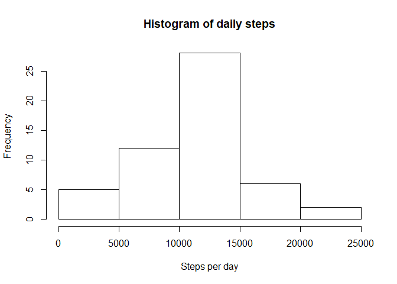
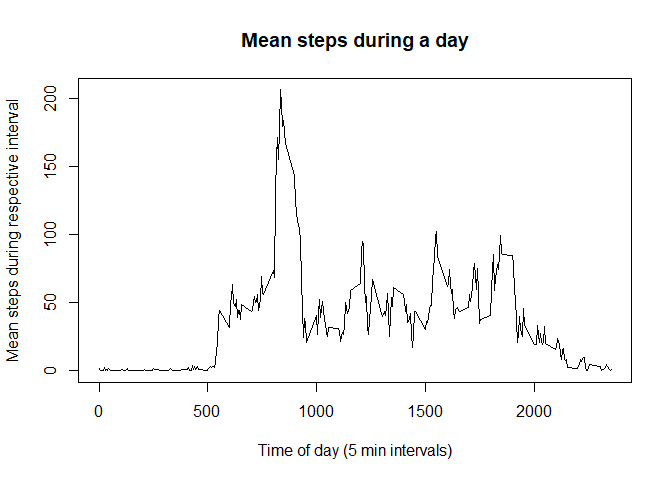
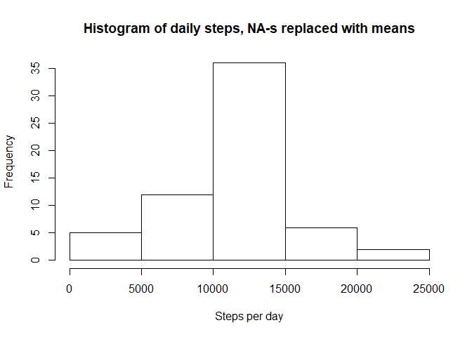
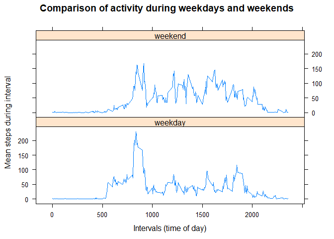

# Reproducible Research: Peer Assessment 1


## Loading and preprocessing the data

We assume the zipped data file is in same directory as R markdown script.


```r
unzip("activity.zip")
activityData <- read.csv("activity.csv")
```


## What is mean total number of steps taken per day?

Calculate aggregate steps per day, resulting data is displayed on a histogram.


```r
dailySteps <- setNames(aggregate(activityData$steps, 
                                 list(activityData$date), sum), 
                       c("date", "steps"))
hist(dailySteps$steps, 
     main = "Histogram of daily steps",  
     xlab = "Steps per day")
```

<!-- -->

Calculate and report the mean and median values of steps per day.


```r
mean(dailySteps$steps, na.rm = TRUE)
```

```
## [1] 10766.19
```

```r
median(dailySteps$steps, na.rm = TRUE)
```

```
## [1] 10765
```

## What is the average daily activity pattern?

### 1. Make a time series plot (i.e. type = "l") of the 5-minute interval (x-axis) and the average number of steps taken, averaged across all days (y-axis)

Calculate mean steps per 5 min intervals. Display a time series (line) plot of the data.


```r
intervalSteps <- setNames(aggregate(activityData$steps, 
                                    list(activityData$interval), 
                                    mean, na.rm = TRUE), 
                          c("interval", "meanSteps"))
plot(intervalSteps, 
     type = "l",
     main = "Mean steps during a day",
     xlab = "Time of day (5 min intervals)", 
     ylab = "Mean steps during respective interval")
```

<!-- -->

### 2. Which 5-minute interval, on average across all the days in the dataset, contains the maximum number of steps?

Following table shows the 5-minute interval during which maximum number of steps occurs and respective number of steps.


```r
intervalSteps[which.max(intervalSteps$meanSteps), ]
```

```
##     interval meanSteps
## 104      835  206.1698
```


## Imputing missing values

### 1. Calculate and report the total number of missing values in the dataset (i.e. the total number of rows with NAs)

The number of missing values in original dataset is:


```r
sum(is.na(activityData$steps))
```

```
## [1] 2304
```

### 2. Devise a strategy for filling in all of the missing values in the dataset. 

I am going to replace NA-s with mean value for that 5-minute interval.

### 3. Create a new dataset that is equal to the original dataset but with the missing data filled in.

New imputedData dataset is created with NAs replaced.


```r
imputedData <- activityData

for (i in 1:nrow(imputedData)) {
    if (is.na(imputedData$steps[i])) {
        imputedData$steps[i] <- 
            intervalSteps[which(imputedData$interval[i] == 
                                    intervalSteps$interval), ]$meanSteps
    }
    
}
```

### 4. Compare the new dataset to the original dataset.

Instruction: Make a histogram of the total number of steps taken each day and Calculate and report the mean and median total number of steps taken per day. Do these values differ from the estimates from the first part of the assignment? What is the impact of imputing missing data on the estimates of the total daily number of steps?

I am going to repeat the steps in the first part of the assignment, with new dataset.

Calculate aggregate steps per day, resulting data is displayed on a histogram.


```r
dailyImputedSteps <- setNames(aggregate(imputedData$steps, 
                                 list(imputedData$date), sum), 
                       c("date", "steps"))
hist(dailyImputedSteps$steps, 
     main = "Histogram of daily steps, NA-s replaced with means",  
     xlab = "Steps per day")
```

<!-- -->

Calculate and report the mean and median values of steps per day for the new dataset.


```r
mean(dailyImputedSteps$steps, na.rm = TRUE)
```

```
## [1] 10766.19
```

```r
median(dailyImputedSteps$steps, na.rm = TRUE)
```

```
## [1] 10766.19
```

#### Comment:
From the histogram it is apparent that the frequency of the 10-15k steps (ie average) days is higher.
Comparing mean and median steps per day shows little if any change (very slight increase of median steps value).
This is as expected, because we filled missing interval values with mean values for these intervals.

## Are there differences in activity patterns between weekdays and weekends?

I use the dataset with the filled-in missing values for this part as instructed in assignment.

### 1. Create a new factor variable in the dataset with two levels - "weekday" and "weekend" indicating whether a given date is a weekday or weekend day.

Instead of using suggested weekdays() function, I decided to us strftime(), which seemed more straightforward.
Results of the code are not displayed.


```r
for (i in 1:nrow(imputedData)) {
    if (as.numeric(strftime(imputedData$date[i], '%u')) == 6 ||
        as.numeric(strftime(imputedData$date[i], '%u')) == 7) {
            imputedData$typeOfDay[i] <- "weekend" 
    } else {
            imputedData$typeOfDay[i] <- "weekday"
        }
        
}

factor(imputedData$typeOfDay)
```

### 2. Make a panel plot containing a time series plot (i.e. type = "l") of the 5-minute interval (x-axis) and the average number of steps taken, averaged across all weekday days or weekend days (y-axis). 


```r
library(lattice)
imputedSteps <- setNames(aggregate(imputedData$steps, 
                                    list(imputedData$interval, 
                                         imputedData$typeOfDay), 
                                    mean), 
                          c("interval", "typeOfDay","meanSteps"))
xyplot(imputedSteps$meanSteps ~ imputedSteps$interval | imputedSteps$typeOfDay, 
       layout = c(1, 2), type = "l", 
       main = "Comparison of activity during weekdays and weekends",
       xlab = "Intervals (time of day)", ylab = "Mean steps during interval")
```

<!-- -->


